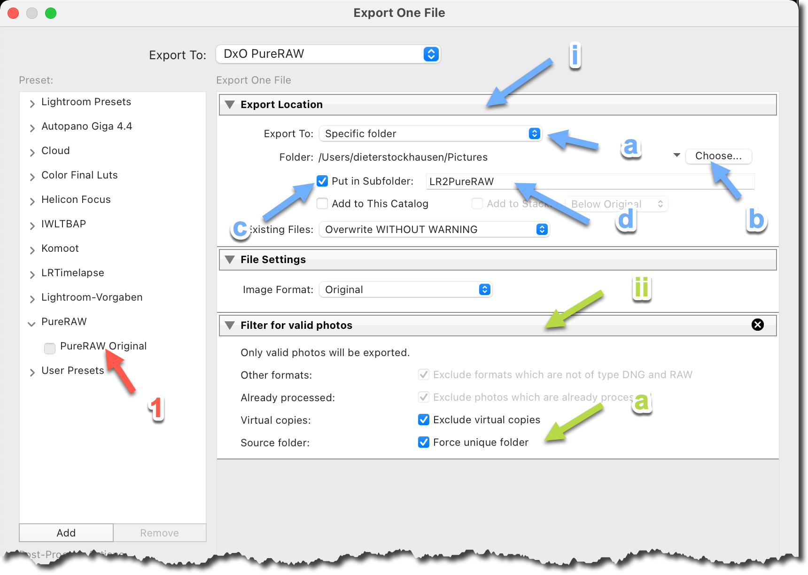
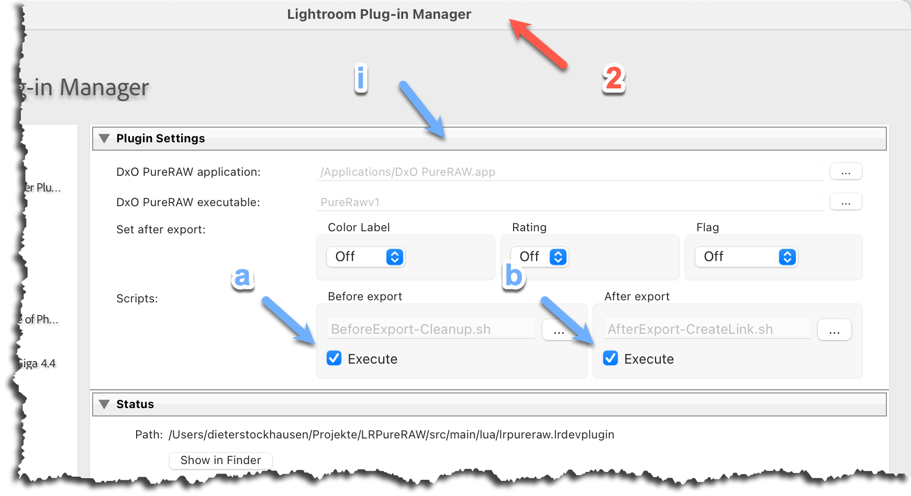
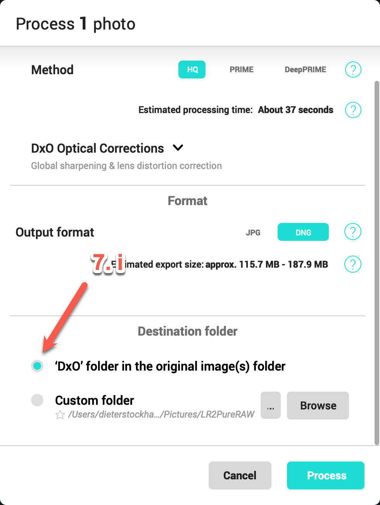
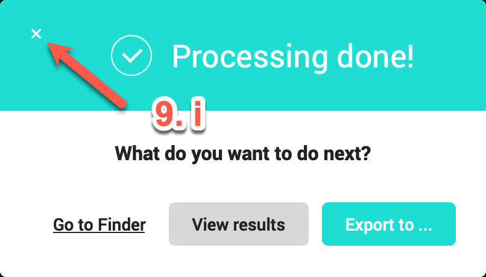
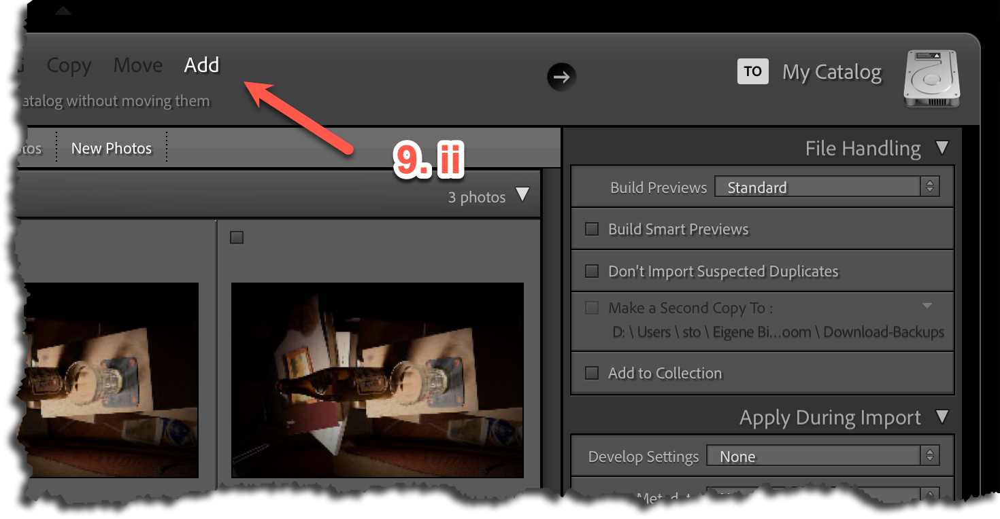
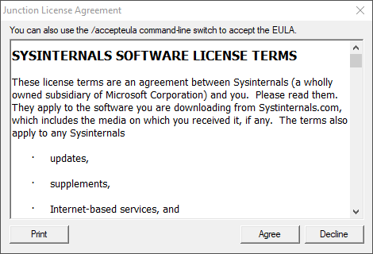

# LRPureRAW

---
_Lightroom Classic_ plug-in which add an export provider for _DxO RureRAW_.

## Features

---
* Export provider (export preset) to send photos to _DxO PureRAW_.
* New in 1.5: Processed photos can automatically be sent back into the original folder -
  see [Export Location](#export-location)
* New in 1.5: Export filter - see [Filter for valid photos](#filter-for-valid-photos):
    * Filter for virtual copies
    * Filter which forces a single source folder
* New in 1.5: Ability to execute custom scripts before/after export - see [Custom scripts](#custom-scripts)
* Set metadata (color, rating, flags) after export to identify the processed photos
* Predefined filters for PureRAW specific attributes

## Requirements

---
* _DxO PureRAW_ 1.X

## Installation

---
1. [Download](https://github.com/sto3014/LRPureRAW/archive/refs/tags/1.5.0.0-alpha.1.zip) the zip archive for version 1.5.0.0.
2. Extract the archive in the download folder. 
3. Install plug-in
    1. On Windows  
       In Explore goto ```Downloads\LRPureRAW-1.5.0.0``` and double click ```Install-Plugin.bat```.
    2. On macOS  
       In Finder goto ```Downloads/LRPureRAW-1.5.0.0``` and double click ```Install-Plugin```  
       Remarks: It is necessary that you use Finder and not another file manager.
4. Restart Lightroom

The plug-in and presets are now available for the current user.


## Update

---
Same as installation. Be aware, that the export preset ```PureRAW Original```will be overwritten.
If you changed this preset before make a copy of it and store it in your ```User Presets```. Your copy will still work 
in version 1.5.

## Usage

---
The basic workflow works roughly as follows:
* Select one or more photos
* Select ```File / Export…```  
* Choose the ```PureRAW Original``` preset  
* Select Export  
  
The selected photos are exported and retrieved in _DxO PureRAW_. 
* In _DxO PureRAW_ process the photos.
* After the photos are processed, export them back to _Lightroom Classic_.  

Only unprocessed DNG and RAW photos are sent to _DxO PureRAW_. If you select other types as well, they are 
just ignored.

## Custom scripts

---
You can create script files (CMD files on Windows, shell scripts on macOS) which are executed before and/or after 
the Lightroom export which uses the _DxO PureRAW_ export provider.  
One example implementation exits in the plug-in folder. The "before" script is used for cleaning up the export location. 
The "after" script is used to create the _DxO_ folder as symbolic link to the original photo folder.
For details see comments in example scripts:
* On Windows
  ```
    %APPDATA%\Adobe\Lightroom\Modules\LRPureRAW.lrplugin\bin\win\AfterExport-CreateLink.cmd
    %APPDATA%\Adobe\Lightroom\Modules\LRPureRAW.lrplugin\bin\win\BeforeExport-Cleanup.cmd
  ```
* On macOS 
    ```
    ~/Library/Application Support/Adobe/Lightroom/Modules/LRPureRAW.lrplugin/bin/mac/AfterExport-CreateLink.sh
    ~/Library/Application Support/Adobe/Lightroom/Modules/LRPureRAW.lrplugin/bin/mac/BeforeExport-Cleanup.sh
    ```
For using your own scripts see also [Scripts](#scripts).


## Best practice

---
###  Export Location
There are two main requests for the export / re-import process:
* The processed photos should be sent back ino the same folder as the original photos. 
* The exported intermediate files should be deleted at the end of the process.
  
Is not possible to tell DxO PureRAW to do these two steps. So, it must be done by the plug-in itself:
1. In the ```PureRAW Original``` preset
   1. Section ```Export location```
      1. Set ```Export to``` to ```Specific folder```
      2. Choose a folder, e.g. your picture folder
      3. Check ```Put in subfolder```
      4. Set a value for subfolder, e.g. LR2PureRAW
   2. Section ```Filter for valid photos```
      1. Check the option ```Force one source```. 
      For details see _force once source_ in [Filter for valid photos](#filter-for-valid-photos)
    3. Do not forget to update ```PureRAW Original``` or even better, create a new preset. 


_Figure: PureRAW Original preset steps:_  


2. In the Plug-in Manager
    1. Section ```Plug-in Settings```
       1. Check ```Execute``` under ```Before export```  
          Verify that the script BeforeExport-Cleanup script is used.
       2. Check ```Execute``` under ```After export```  
          Verify that the script AfterExport-CreateLink script is used.

_Figure: Plug-in Manager steps:_  


With these settings the workflow is as follows:
1. You
    1. You select (RAW/DNG) photos from one folder
2. You
    1. You select ```File / Export with preset… / PureRAW Original```
3.  BeforeExport-Cleanup Script
    1. The script deletes all files from the last export. E.g., it cleans up _\<Picture folder>/LR2PureRAW_
4. Lightroom
    1. Lightroom exports the selected photos into the export location. E.g. _\<Picture folder>/LR2PureRAW_
5. AfterExport-CreateLink Script
    1. The script creates the symbolic link _DxO_ in the export location which points to the original folder.  
    E.g. _\<Picture folder>/LR2PureRAW/DxO_ <---> _\<Picture folder>/Lightroom/Photos/2022/2022-01/2022-01-06-Wedding_
6. Lightroom  
    1. Lightroom starts / activates _DxO PureRAW_
7. You
    1. You process your photos by choosing the _DxO_ folder as your target folder.  
    See figure _DxO PureRAW Process start_
8. DxO PureRAW
    1. DxO PureRAW processes the photos and store these into _\<Picture folder>/LR2PureRAW/DxO_ respectively 
      _\<Picture folder>/Lightroom/Photos/2022/2022-01/2022-01-06-Wedding_
9. You
    1. After DxO has processed your photos, you may _NOT_ use _DxO PureRAW_ for exporting.  
       See figure _DxO PureRAW Process done_.
    2. Instead you go back to Lightroom and synchronize your folder, i.e.,
      _\<Picture folder>/Lightroom/Photos/2022/2022-01/2022-01-06-Wedding_ in our example.  
       See figure _Lightroom import via synchronize folder_.

_Figure: DxO PureRAW Process start:_  
  
_Figure: DxO PureRAW Process done:_  
    
_Figure: Lightroom import via synchronize folder:_  
  


Remarks:  
* Under macOS it is possible to use the DxO Export functionality (step 9.1). During Lightroom import you have to choose
  the ```Add``` option, because the photos are already in the right place.  
Under Windows, it does not work. The Windows version of Lightroom is not aware of symbolic links.  
  If you use the DxO Export functionality in Windows, a new Folder _DxO_ is created in the folder section of the library module.
* For creating symbolic links, we use the tool [Junction](https://docs.microsoft.com/en-us/sysinternals/downloads/junction)
  from Sysinternals / Microsoft. Therefore, when you do the first export, a dialog-box with a license agreement pops up, 
  and you must agree:   
    


#### Caution
For those people which are not used to symbolic links, keep in mind:  
The _DxO_ folder in your export location is such a symbolic link. You may delete it at any time, but do not 
delete it's content. If you delete the content, you delete your original photos.

### Validation
In general, _DxO PureRAW_ only supports  
* RAW and DNG files from [cameras and lenses which are supported](https://www.dxo.com/supported-cameras/)
* none linear DNG files  
  The RAW or DNG which comes out of your camera are none linear. But if you create a panorama in Lightroom you get 
  a linear DNG. Also, an output file from DxO PureRAW is a linear DNG.  
  
Any other formats are not supported.  

This plug-in can support your workflow by filtering the selected photos and reject photos which are not valid.
This includes photos which are virtual copies or photos which comes from different folders.  
See [Filter for valid photos](#filter-for-valid-photos).

### Set metadata after export

At the end of the DxO workflow, the processed photos and the original ones reside normally in the same folder. Depending on  
your sorting settings they even stand side by side. For organisation purpose, it might make sense to set metadata like the color
during export. See [Set after export](#set-after-export) for possible settings.

### Stacking processed and original photos

This plug-in can't do an automatic stacking, but you can use the auto-stack functionality of Lightroom. The processed, 
and the original photo have the same capture time. Therefore, it is easy to stack them automatically by 
selecting ```Photo / Stacking / Auto-Stack by Capture time…``` and set the time difference to 0.

## Plugin Settings

---
### DxO PureRAW
In this section the paths for the _DxO PureRAW_ executable are defined.
* On Windows
    * DxO PureRAW Executeable  
    Path to the exe file. The default value is ```C:\Program Files\DxO\DxO PureRAW\PureRawv1.exe```   
      If DxO PureRAW was installed in a different place you have to select the executable by yourself.
* On macOS
    * DxO PureRAW Application
      Path to the application. The default value is ```/Applications/DxO PureRAW.app```   
      If DxO PureRAW was installed in a different place you have to select the executable by yourself.
    * DxO PureRAW Executeable  
    The name of the executable. The default value is ```PureRawv1```  
      
      
### Set after export
In this section you can configure metadata which is set before the export. This configuration supports:
* Color labels
* Ratings
* Flags

This metadata is set on the original photos after the export has finished. I.e., re-imported photos have the  
original metadata before the metadata was set.

### Scripts
In the script section you can define scripts which run before or directly after the Lightroom export.
The standard script which can be executed before the export is ```BeforeExport-Cleanup.cmd``` on Windows and 
```BeforeExport-Cleanup.sh``` on macOS. For after export it is ```AfterExport-CreateLink.bat``` 
respectively ```AfterExport-CreateLink```.  
The ```Execute``` check-box activates/deactivates the corresponding script.

## Export Preset

---
The ```PureRAW Original``` preset is responsible for the export. It uses the service provider ```DxO PureRAW``` 
(```Export to``` field on top of page).  
It provides 3 sections
* [Export location](#export-location)  
  This is a standard Lightroom section.
* [File settings](#file-settings)
  This is a standard Lightroom section.
* [Filter for valid photos](#filter-for-valid-photos)  
  Post Process-Action "PureRAW / Valid Photos"

If you change this export preset you should add it as a new preset, because the ```PureRAW Original``` will be 
overwritten on subsequent updates.

If you create an export preset from the scratch and use the service provider ```DxO PureRAW``` you must add the post 
process-action ```Valid Photos``` as well, if you want to use it.  

### Export location
The ```Export Location``` decides to where the files are
exported. The possible settings are the same as for other presets. There is only one restriction: If any script is running
during export (see [Scripts](#scripts) chapter), the location must be set to ```Special folder```, the option ```Export to``` 
must be checked, and the subfolder field must have a value. 

### File settings
The file settings are limited to two image formats: ```Original``` and ```DNG```
Best is to work with ```Original```, just because of the naming of the files. E.g, if you work with NEF or CRW files
the processed files from DxO PureRAW keep the suffix in its name, even if the suffix changes to ".dng". 
By the way, if your camera is not supported, it does not help to convert it to an DNG file. DxO PureRAW will reject it
anyway.

### Filter for valid photos
The ```Filter for valid photos``` register defines 4 filter options:  
* Other formats  
  Only DNGs or RAW files will pass this filter.  
  Limitation: The RAW filter does not differentiate between camera types. I.e., even
  if _DxO PureRAW_ does not support the camera type, the RAW file of this camera will be exported.  
  This filter is always active and you can't change it. It is displayed just for clearness.
* Already processed  
  A photo which was already exported by DxO PureRAW will be ignored. This filter compares the (EXIF) property 
  ```Software```. If the value is ```DxO PureRAW``` it will be rejected.  
  This filter is always set to true, and you can't change it. It is displayed just for clearness.
* Exclude virtual copies  
  Maybe you do not want that a virtual copy is exported, because you prefer another workflow:
  * process the original photo
  * make a virtual copy of the processed photo
  * sync the settings.  
* Force one source  
If you select photos which reside in multiple folders it makes it hard to import the processed photos back to Lightroom.
  It is even more critical if you use the ```AfterExport-CreateLink``` script. In this case the processed photos will be 
  stored into any of the original folders.  
  Therefore, it is a good idea for the most workflows to check this option.


## Filter Preset

---
There are three filter presets which may support your workflow:
* PureRAW (candidate)  
  Displays only photos which can be exported by the _PureRAW Original_ preset.  
  Virtual copies will not be taken into account. 
* PureRAW (excluded)  
  Displays only photos which were not processed. 
* PureRAW (only)  
Displays only processed photos.
  
  
## Known Issues

---
###Length of command line
The photos are sent to _DxO PureRAW_ via command line. The length of the command line is restricted in length. The 
more photos we sent, the longer the command line will be. The command line length limits are:
* Windows: 8191  
* Mac: 262144   
I.e., on Mac we do not have a real limit in amount of photos, but in Windows we have. 
Be as it is, even in Windows 100 photos should not be a problem to convert in one step.
  
###LR Import dialog will not be opened
When exporting the developed DxO photos from the _Pictures folder_ (or a subfolder of it) into Lightroom the 
Lightroom's import dialog will not be open. It seems to be a DxO PureRAW issue, because it can be reproduced by exporting 
any photo from this folder to Lightroom. 
Therefore, the default export path was changed to _Same folder as original photo_ in 1.0.2.2.
At the time this issue is documented only for Windows systems.

## Acknowledgements
Thanks to [Mark Russinovich](https://docs.microsoft.com/de-de/archive/blogs/markrussinovich/) for his brilliant tools 
in general and in details for [Junction](https://docs.microsoft.com/en-us/sysinternals/downloads/junction) which I used 
to create symbolic links.